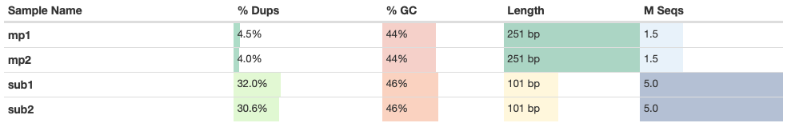
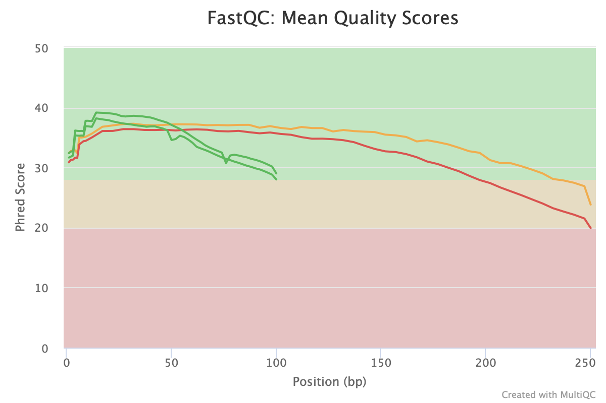
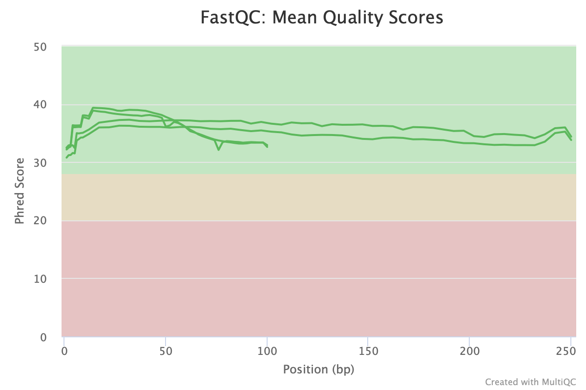
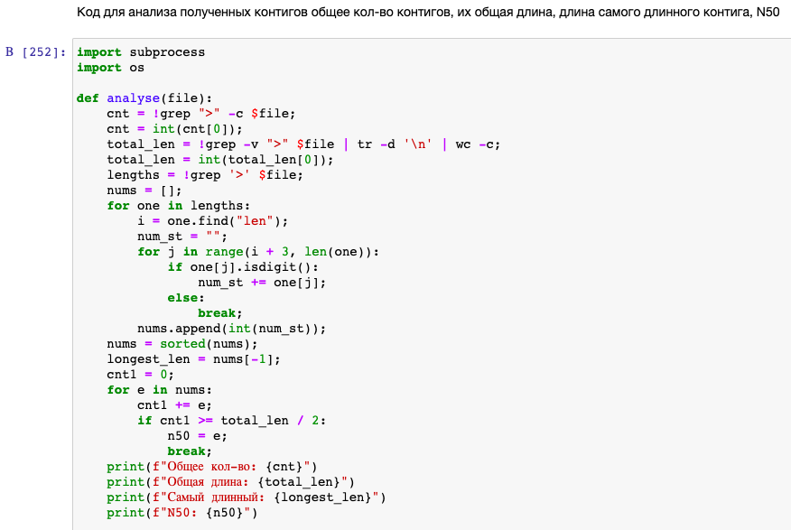
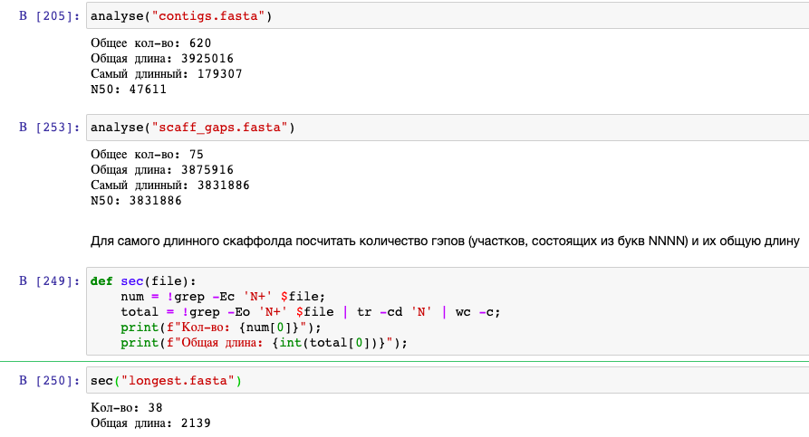

# ДЗ №1 
### Поморцев Леонид 2 группа
Создаем директорию
```
mkdir hw
cd hw
mkdir first
cd first
```
Создаем ссылки на данные
```
ln -s /usr/share/data-minor-bioinf/assembly/oil_R1.fastq  
ln -s /usr/share/data-minor-bioinf/assembly/oil_R2.fastq  
ln -s /usr/share/data-minor-bioinf/assembly/oilMP_S4_L001_R1_001.fastq  
ln -s /usr/share/data-minor-bioinf/assembly/oilMP_S4_L001_R2_001.fastq
```
Отбираем случайные чтения 
```
SEED=124
seqtk sample -s$SEED oil_R1.fastq 5000000 > sub1.fastq
seqtk sample -s$SEED oil_R2.fastq 5000000 > sub2.fastq
seqtk sample -s$SEED oilMP_S4_L001_R1_001.fastq 1500000 > mp1.fastq
seqtk sample -s$SEED oilMP_S4_L001_R2_001.fastq 1500000 > mp2.fastq
```
Делаем удобную функцию
```
Dofastqc() {
  rm -rf fastqc multiqc
  mkdir fastqc multiqc
  fastqc "$@" -o fastqc
  multiqc fastqc -o multiqc
}
```
Проверяем качество
```
Dofastqc mp*.fastq sub*.fastq
```
Подрезаем
```
platanus_trim sub*.fastq
platanus_internal_trim mp*.fastq
```
Удаляем ненужное
```
rm mp*.fastq           
rm sub*.fastq
```
Проверяем качество для подрезанных
```
Dofastqc *trimmed
```
Соберём контиги, скаффолды:
```
platanus assemble -f *.trimmed
platanus scaffold -c out_contig.fa -IP1 *.trimmed -OP2 *.int_trimmed
platanus gap_close -c out_scaffold.fa -IP1 *.trimmed -OP2 *.int_trimmed
rm *trimmed
```
Возьмем самый длинный в файл longest
```
sed -n '1,/^>/p' scaffolds.fasta | head -n -1 > longest.fasta
```
## Статистика multiqc
### Для обычных файлов
Ссылка на отчет: https://github.com/harspect/hse21_hw1/blob/main/multiqc_report_simple.html


### Для trimmed файлов
Ссылка на отчет: https://github.com/harspect/hse21_hw1/blob/main/multiqc_report_trimmed.html


### Код из Jupyter notebook
```python
def analyse(file):
    cnt = !grep ">" -c $file;
    cnt = int(cnt[0]);
    total_len = !grep -v ">" $file | tr -d '\n' | wc -c;
    total_len = int(total_len[0]);
    lengths = !grep '>' $file;
    nums = [];
    for one in lengths:
        i = one.find("len");
        num_st = "";
        for j in range(i + 3, len(one)):
            if one[j].isdigit():
                num_st += one[j];
            else:
                break;
        nums.append(int(num_st));
    nums = sorted(nums);
    longest_len = nums[-1];
    cnt1 = 0;
    for e in nums:
        cnt1 += e;
        if cnt1 >= total_len / 2:
            n50 = e;
            break;
    print(f"Общее кол-во: {cnt}")
    print(f"Общая длина: {total_len}")
    print(f"Самый длинный: {longest_len}")
    print(f"N50: {n50}")
```
```python
def sec(file):
    num = !grep -Ec 'N+' $file;
    total = !grep -Eo 'N+' $file | tr -cd 'N' | wc -c;
    print(f"Кол-во: {num[0]}");
    print(f"Общая длина: {int(total[0])}");
```


